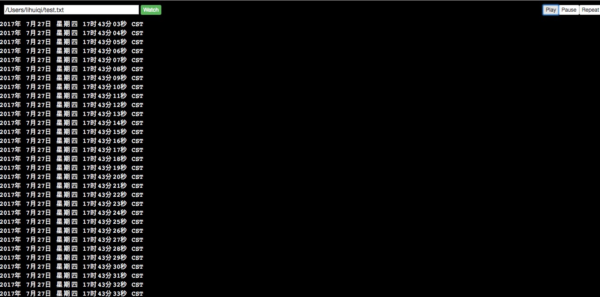

# WEB tail


## How to run this example ?


```sh
cd web_tail; pip install -r requirements.txt && python server.py
```

Open your browser and navigate to [http://localhost:8080](http://localhost:8080/static/entry)




## Config file

- etc/server.conf


## Actions

* `play` - monitoring file.
* `pause` - Pause monitoring, press `play` button to continue monitoring.
* `repeat` - Re-monitor the file from the first open file position.

